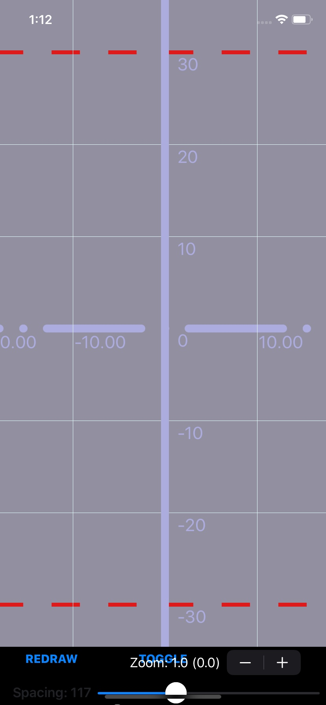
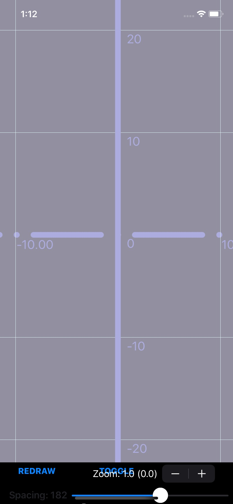
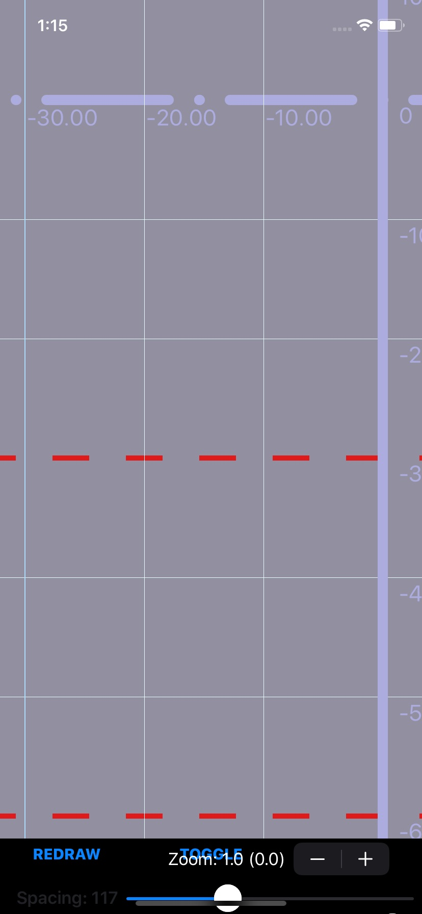
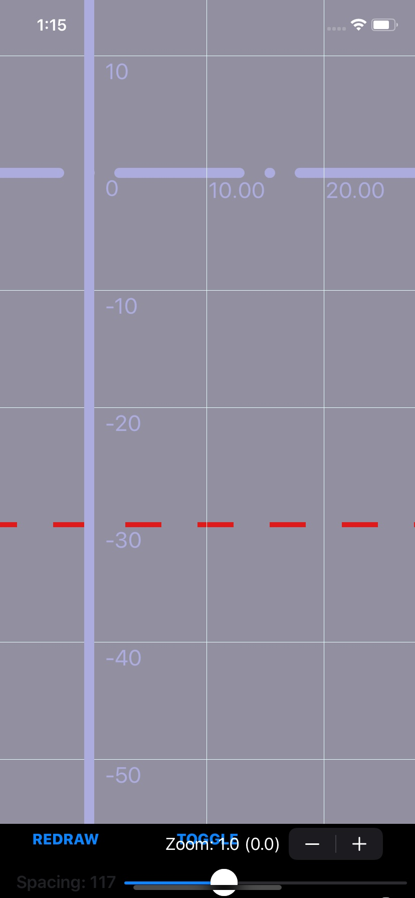
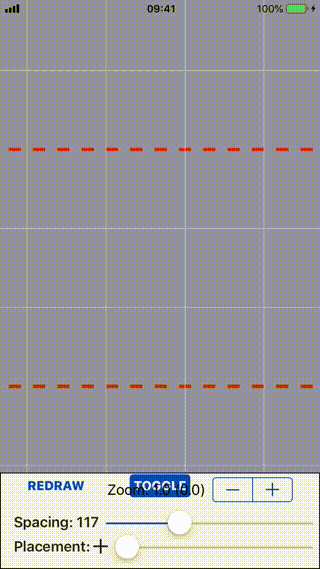

# MJGridView

[](https://cocoapods.org/pods/MJGridView)
[](https://cocoapods.org/pods/MJGridView)
[](https://cocoapods.org/pods/MJGridView)

A view for displaying a zoomable coordinate grid. Grid is rendered with more details as it's zoomed in, or rendered with less details as it's zoomed out.   
Made using `CATiledLayer`. Rendered in a grid of tiles, each tile asynchronously on a separate thread.

## Features
- Customizable origin position. ✅
- Customizable axes' line color, width and dash patterns ✅
- Customizable other line's color, width and dash patterns by specifing `divisor` ✅
- Customizable line spacing ✅
- Customizable axis' line label attributes, format and position insets ✅
- Separate axis scale customization ✅
- Dash pattern rounded caps (experimental) ✅

## Planned
- Skippable lines 💤
- Axis label orientation 💤
- Labels on all other lines 💤

## Usage
- Add `ZoomableGridView` to your view hierarchy
- Customize via `gridProperties` (See `GridProperties` documentation for more details), `minimumZoomScale` and `maximumZoomScale`.
- Zoom your own views alongside the grid view by adding them to `gridContainerView`

## Some Examples
<p float="center">
  
   
</p>
<p float="center">
  
   
   
</p>



## Example

To run the example project, clone the repo, and run `pod install` from the Example directory first.

## Installation

MJGridView is available through [CocoaPods](https://cocoapods.org). To install
it, simply add the following line to your Podfile:

```ruby
pod 'MJGridView'
```

## Author

Miloš Jagetić, milos.jagetic@gmail.com

## License

MJGridView is available under the MIT license. See the LICENSE file for more info.
